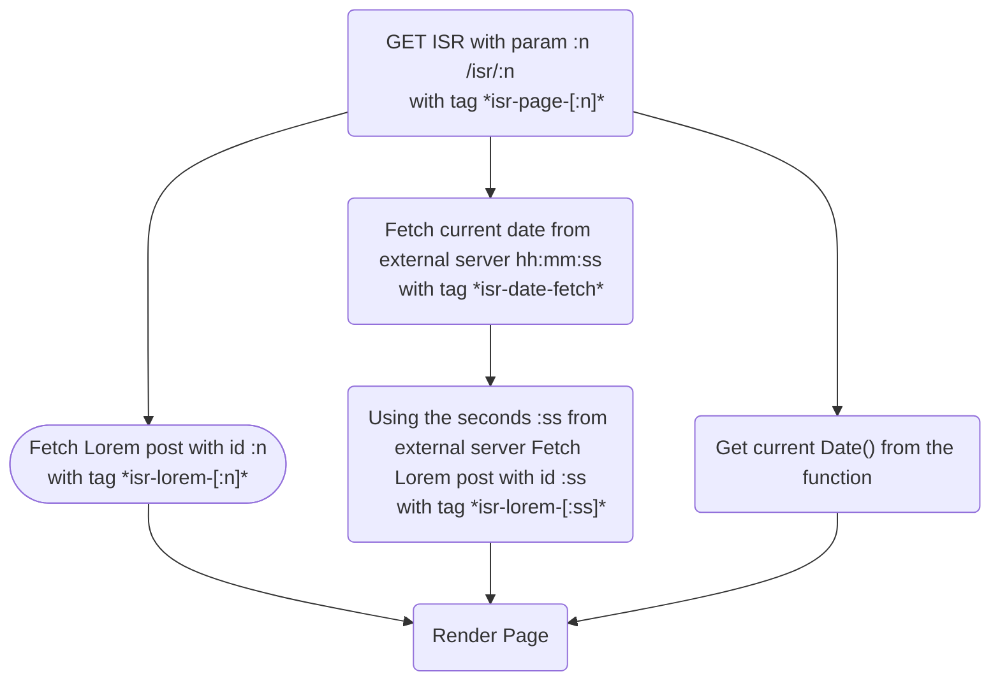

# Flow Diagram

```mermaid
graph TD;
    A("GET ISR with param :n /isr/:n
      with tag *isr-page-[:n]*
    ")-->B(["Fetch Lorem post with id :n
    with tag *isr-lorem-[:n]*"]);
    B-->F;
    A-->C("Fetch current date from external server hh:mm:ss
    with tag *isr-date-fetch*
    ");
    C-->D("Using the seconds :ss from external server Fetch Lorem post with id :ss
    with tag *isr-lorem-[:ss]*");
    A-->E("Get current Date() from the function");
    D-->F("Render Page");
    E-->F;
```